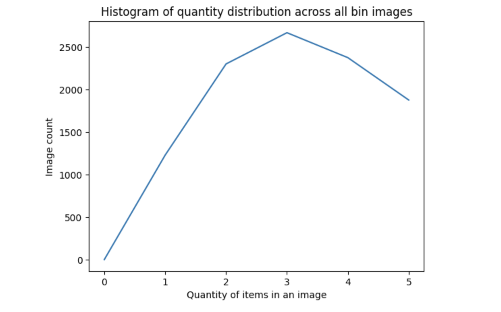

# Inventory Monitoring at Distribution Centers

Inventory monitoring is a crucial job at any distribution centers. Many distribution centre are utilising robots to move objects as a part of their operations. Objects are carried in bins which can contain multiple objects. In this project, I will build a model that can count the number of objects in each bin. A system like this can be used to track inventory and make sure that delivery consignments have the correct number of items.

## Dataset

### Overview
To complete this project I will be using the Amazon Bin Image Dataset. The dataset contains 500,000 images of bins containing one or more objects. For each image there is a metadata file containing information about the image like the number of objects, it's dimension and the type of object. For this task, I will try to classify the number of objects in each bin. The images are available here: s3://aft-vbi-pds/bin-images/. Images are located in the bin-images directory, and metadata for each image is located in the metadata directory. Images and their associated metadata share simple numerical unique identifiers. For example, the metadata for the image at https://aft-vbi-pds.s3.amazonaws.com/bin-images/523.jpg is found at https://aft-vbi-pds.s3.amazonaws.com/metadata/523.json.

Following is an example image:


### Access

The data is hosted on an S3 bucket. I have processed only a subset of the actual data in this project. The `file_list.json` contains a subset of all images - only catering up to 5 counts of objects in the bin. In my notebook, I am using the function `download_and_arrange_data` to download the data. 

Some statistics on the data:

```Total Images: 10441
Average expected quantity in a bin: 10441/5: 2088.2
total images with quantity 1 is 1228
total images with quantity 2 is 2299
total images with quantity 3 is 2666
total images with quantity 4 is 2373
total images with quantity 5 is 1875
```
Showing histogram of quantity distribution:



After downloading the data I am reorganizing and splitting the dataset into train, validation and test datasets. Train dataset has 70% of the data and both validation and test datasets have 15% of the data each.
I am then uploading the data into S3 bucket: `s3://inventory-monitoring-1`

## Model Training
I am using ResNet-50, which is a pretrained Deep Learning model for image classification of the Convolutional Neural Network. It is a CNN with 50 layers. The ImageNet database contains a pre-trained version of the network that has been trained on more than a million photos. 
I have run hyperparameter tuning job for the parameters: learning rate, momentum and batch size. Best values were:
```
lr: 0.002855165887726784
batch size: 64
momentum: 0.8531139470926627
```
I have calculated Average test loss and RMSE and model accuracy. My model did not achieve a great result. Following are the evaluation metrics:
```
Testing Loss: 1.487504923176187
Testing RMSE: 43.2241711911728
Testing Accuracy: 28.097062579821202
```
I think with more data and larger epochs for traning, the metrics will improve.

## Machine Learning Pipeline

To begin with I have created a baseline model, which was a CNN from scratch. 
Testing Loss: 1.5787154548774125, Testing RMSE: 45.87388441802, Testing Accuracy: 25.54278416347382 

## Standout Suggestions
I have attemped Hyperparameter tuning and debugging.
