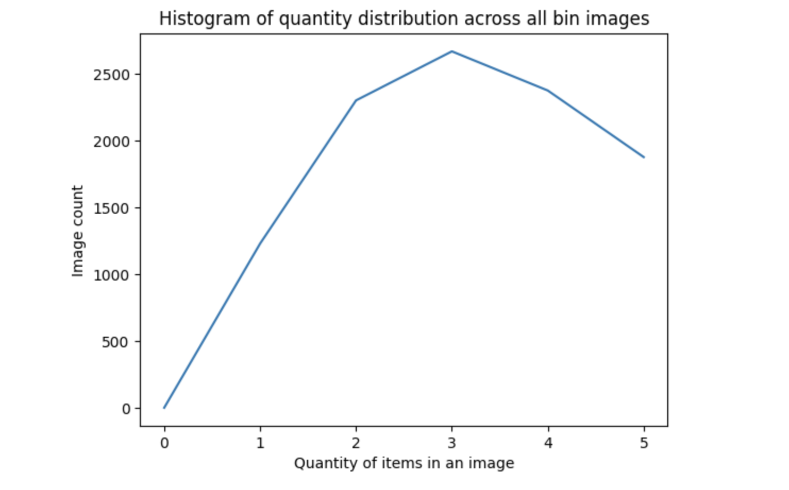
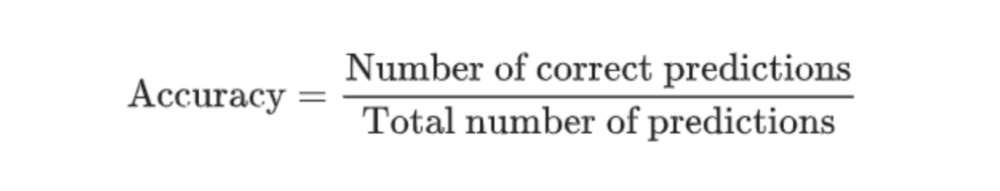

# Machine Learning Engineer Nanodegree
## Capstone Proposal

`Ayesha Mosaddeque`

March 9th, 2023

## Proposal

### Domain Background

Computer Vision is a field of Artificial Intelligence, where a compute system can extract important information from visual inputs like images, videos etc. While Computer Vision may sound like a new idea, it actually began around mid 1960s. We can see its applications in many differnt fields like automotives, manufacturing, retail, healthcare etc. 

Calculating the number of objects present in a visual input is one of the rudimentary tasks of Computer Vision. This has many practical usage like, traffic flow monitoring, surveillance, product counting etc.

This object counting approach can potentially optimize large e-commerce company like Amazon's distribution centre to a great extent.Amazon has their own warehouses and logistics services known as Amazon Fulfillment centre. Among many concerns, inventory monitoring is a significant one. Object counting could imaginably enhance the inventory monitoring system by many folds in this case. Bertorello et al. (2018) has an academic research done in this domain.

### Problem Statement

Inventory monitoring is a crucial job at any distribution centers. Many distribution centre are utilising robots to move objects as a part of their operations. Objects are carried in bins which can contain multiple objects. In this project, I will build a model that can count the number of objects in each bin. A system like this can be used to track inventory and make sure that delivery consignments have the correct number of items.

### Datasets and Inputs

To complete this project I will be using the Amazon Bin Image Dataset. The dataset contains 500,000 images of bins containing one or more objects. For each image there is a metadata file containing information about the image like the number of objects, it's dimension and the type of object. For this task, I will try to classify the number of objects in each bin. The images are available here: s3://aft-vbi-pds/bin-images/. Images are located in the bin-images directory, and metadata for each image is located in the metadata directory. Images and their associated metadata share simple numerical unique identifiers. For example, the metadata for the image at https://aft-vbi-pds.s3.amazonaws.com/bin-images/523.jpg is found at https://aft-vbi-pds.s3.amazonaws.com/metadata/523.json.

Following is an example image:


Following is the corresponding metadata file:
```
{
    "BIN_FCSKU_DATA": {
        "B000A8C5QE": {
            "asin": "B000A8C5QE",
            "height": {
                "unit": "IN",
                "value": 4.200000000000001
            },
            "length": {
                "unit": "IN",
                "value": 4.7
            },
            "name": "MSR PocketRocket Stove",
            "quantity": 1,
            "weight": {
                "unit": "pounds",
                "value": 0.45
            },
            "width": {
                "unit": "IN",
                "value": 4.4
            }
        },
        "B0064LIWVS": {
            "asin": "B0064LIWVS",
            "height": {
                "unit": "IN",
                "value": 1.2
            },
            "length": {
                "unit": "IN",
                "value": 5.799999999999999
            },
            "name": "Applied Nutrition Liquid Collagen Skin Revitalization, 10 Count 3.35 Fl Ounce",
            "quantity": 1,
            "weight": {
                "unit": "pounds",
                "value": 0.3499999999999999
            },
            "width": {
                "unit": "IN",
                "value": 4.7
            }
        }
    },
    "EXPECTED_QUANTITY": 2,
    "image_fname": "523.jpg"
}
```
The metadata file contains the expected quantity.

Some statistics on the data:

```Total Images: 10441
Average expected quantity in a bin: 10441/5: 2088.2
total images with quantity 1 is 1228
total images with quantity 2 is 2299
total images with quantity 3 is 2666
total images with quantity 4 is 2373
total images with quantity 5 is 1875
```
Showing histogram of quantity distribution:



### Solution Statement

My capstone project is going to be about inevntory monitoring. In this project I will create an Image classification system, which will be able to determine how many objects are present in a certain space at one time. 

The model will be trained and deployed on AWS platform. I intend to use AWS Sagemake studio for implementing the model and other necessary tasks. 

Apart from creating a simple Convolutional Neural Network model, I will also use transfer learning to finetune a pretrained model like resnet.

### Benchmark Model

For benchmarking,  I will create a simple Convolutional Neural Network model. Using this model, I will calculate the accuracy. Following on from here I will fine tune a pretrained model and compare the result. 
I am planning on using PyTorch library for creating the CNN model.

### Evaluation Metrics

Evaluation metrics for this project will be two standrad metrics, accuracy(precision) and root mean square error(RMSE). 




### Project Design

I will first download the subset of the bin image data ([Amazon Bin Image Dataset](https://registry.opendata.aws/amazon-bin-imagery/)). as suggested. Then I will create train, validation and test split. I plan to make 80% train, 10% validation and 10% test dataset split. 

I will apply some data augmentation (RandomRotation, Resize) on the images while generating the data loaders. I will then train my initial benchmark model. I will calculated accuracy and RMSE of the model.

Following on I will finetune a pretrained model using PyTorch library and I will calculated accuracy and RMSE of the model.

I will then compare the performance of these two models.

-----------

References:
Bertorello et al. (2018) 

Rodriguez Bertorello, Pablo Martin and Sripada, Sravan and Dendumrongsup, Nutchapol, Amazon Inventory Reconciliation Using AI (December 15, 2018). Available at SSRN: https://ssrn.com/abstract=3311007 or http://dx.doi.org/10.2139/ssrn.3311007

Amazon Bin Image Dataset was accessed on 10th March 2023 from https://registry.opendata.aws/amazon-bin-imagery.
